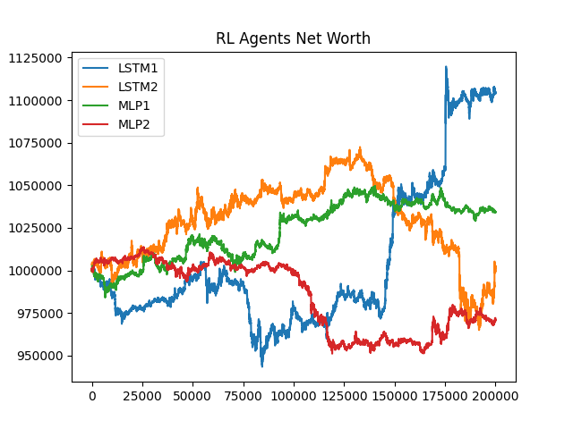

# Deep Reinforcement Learning in Crypto Trading
### Senior Design Project 2022-2023

<p align="center">

</p>

Inspired by https://github.com/notadamking/Stock-Trading-Environment, this is an implementation of deep reinforcement learning for cryptocurrency algorithmic trading.

# Installation

## Python 3.7
### (Does not support Python 3.8+)

Clone this repository

```BASH
git clone https://github.com/KodeUniverse/Deep-RL-Crypto.git
cd Deep-RL-Crypto
```

It is recommended to use a virtualenv
```BASH
virtualenv venv --python="/usr/bin/python3.7"
#activate the venv
source venv/bin/activate

#downgrade setuptools version
pip install --upgrade setuptools==66
pip install -r requirements.txt
```

# Usage

Run main.py after requirements are installed.

